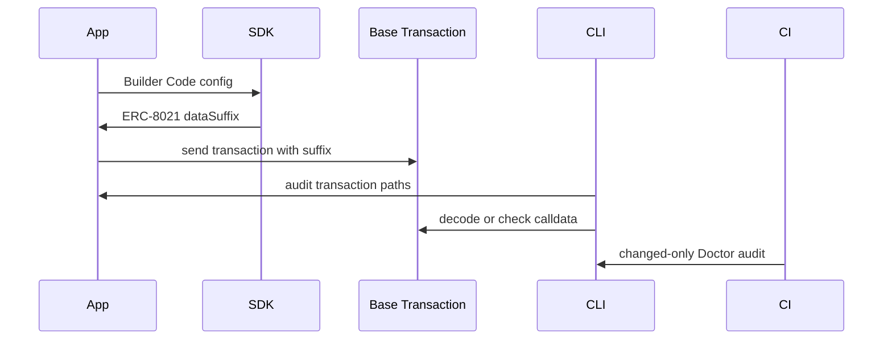

# Architecture

BAO Toolkit combines local SDKs and CLI tools, CI checks, and a web workspace for
Base attribution evidence. The v0.6 release contains nine public npm packages
under the existing `@base-attribution-os/*` scope.

## Layers

- Core: ERC-8021 suffix encoding and validation, transaction replay, and Proof Sets.
- B20: source-pinned token inspection, receipt-aware replay, and artifact verification.
- Adapters: helpers for viem, wagmi, ethers, EIP-5792, and ERC-4337 flows.
- Scanner: AST-backed transaction discovery, rule evaluation, baselines, and
  SARIF output.
- CLI: `bao doctor`, config initialization, calldata, transaction, and
  compatibility scan commands.
- GitHub Action: annotations and coverage summaries around the Doctor report.
- Web workspace: Activity, Evidence, Doctor, Proofs, B20, and Wallets. Local file
  imports run in the browser; the optional Dune integration runs on the server.
- Examples: reference integrations for apps, wallets, agents, and x402 payment
  paths.

## Data flow

## Boundaries

BAO does not decide reward eligibility or replace Base.dev. Static analysis checks
supported source patterns; replay and proof artifacts describe declared transaction
samples. Neither establishes complete runtime coverage of an application.

The web workspace includes a dashboard, but BAO does not operate a general hosted
ingestion service. Dune-backed activity requires server configuration; local
imports and published proof artifacts remain available without it.

Scanner profiles define how strongly repository scans should enforce attribution:

- `local`: surface findings without blocking integration work by default.
- `ci`: fail missing or wrong Builder Codes and warn on dynamic evidence.
- `strict`: require every path to match verifiable attribution evidence.

The AST layer is intentionally static. It recognizes project-level SDK config
and direct call-site evidence, but does not execute environment-dependent code.
Locally implemented attribution helpers are unresolved even when their arguments
contain the expected Builder Code. See the [Doctor boundary](attribution-doctor.md#static-analysis-boundary).
